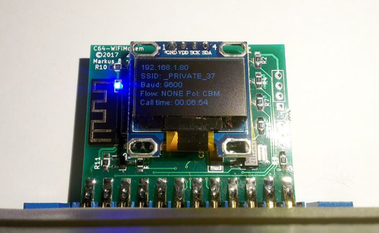
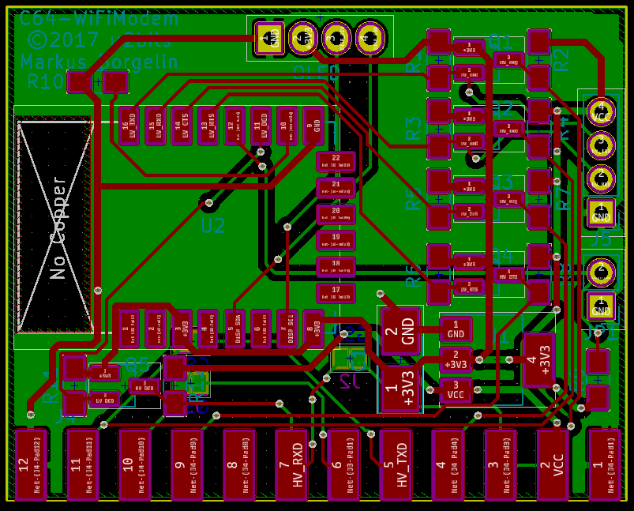
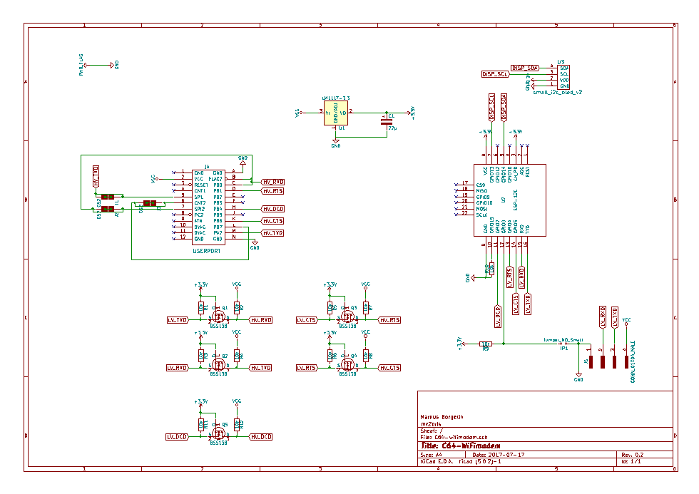

# c64-wifimodem

## src
Source code for my c64-wifimodem

Feel free to make changes and correction.

## Important
- Please change example.com to your own domain for OTA updates. 
- You will also have to create a backend for OTA to work.

## Stuff that needs work
- Changing pin polarity does not work as expected.
  - V-1541 and commodoreserver.com should work if implemented correct. I had it working, but then normal cbm polarity didn't work as it should.
- Higher baud rates
  - 19200 and 38400 will work but is only used with flipped polarity as I know of.
- Incoming calls
  - I am not enough familiar with bbs servers answering mechanism, and couldn't get it to work with my badly set up bbs server.
  - Direct call connection to the modem does work, sort of.
- S-registers
  - May be useful, I don't know.

## c64-wifimodem
PCB files in kicad format. Nothing much to say about it.

